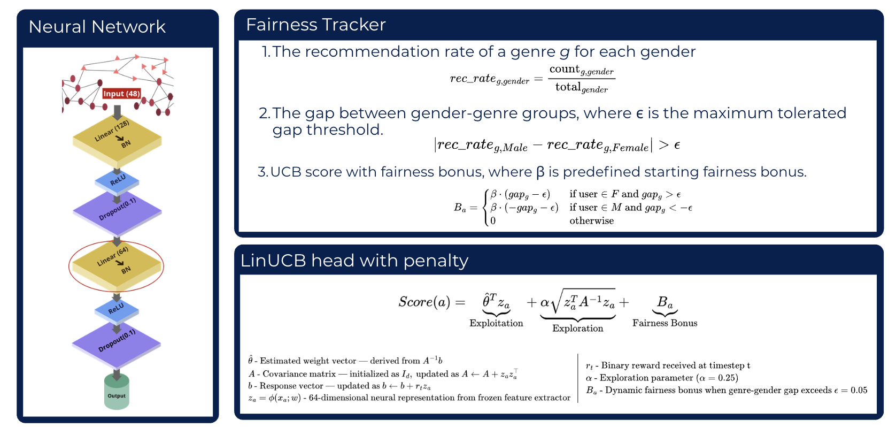

# FairNeuralLinUCB-Model
A contextual bandit-based recommendation system that addresses the fair-utility tradeoff.

The modern recommendation systems are largely neural-based, addressing the efficiency, cold-start, and filter bubble problems of traditional systems such as Content-based Filtering (CBF), Collaborative Filtering (CF), and Hybrid systems. Contextual bandit-based systems are widely studied and currently used in production content recommendation environments (movies, songs, etc.).

Fairness of the recommendation system is also a widely addressed, timely topic that focuses on building ethical and unbiased recommendation systems from both the user and item sides, mitigating group and individual unfairness in recommendations. However, linear Fair models reduce utility due to the added 'cost of fairness'.

A neural-based recommendation system can build an efficient system by identifying non-linear patterns in user-item features and improving overall recommendation accuracy. But by doing so, they might introduce algorithmic biases based on patterns identified in the data the system is trained on. 

Fair-NeuralLinUCB is a model that addresses the bias in contextual bandit-based NeuralLinUCB models while retaining their utility. This model combines a fairness penalty mechanism and neural feature extraction, designed specifically for a movie recommendation system. The model is then trained on the MovieLens 1M dataset, focusing on gender-based group fairness, and compared against two baseline models: FairLinUCB (Huang et al., 2021) and NeuralLinUCB (Shi et al., 2023).  

The results of the model were promising, showing a statistically significant performance over the linear fairness model and mitigating the gender bias detected in the neural model.
